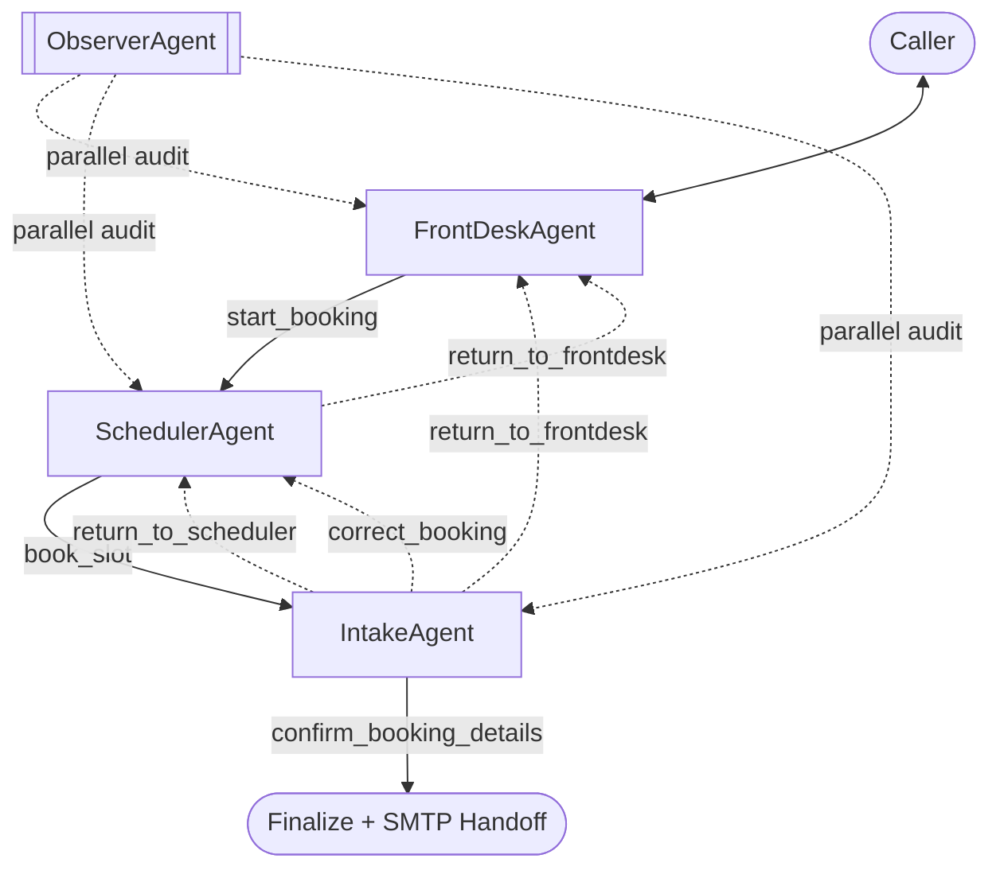
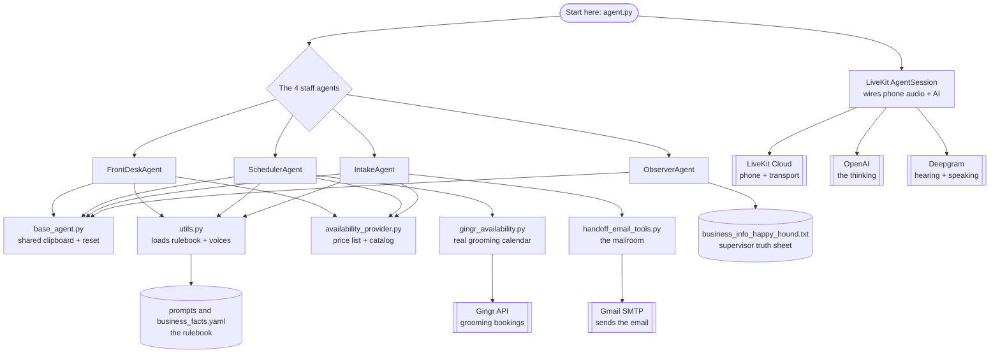
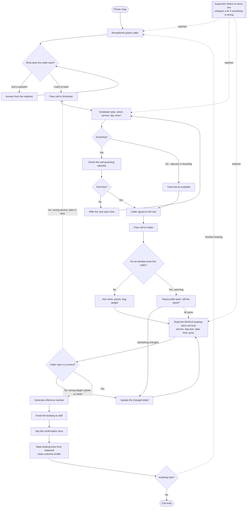

# Happy Hound Multi-Agent Voice Receptionist

LiveKit-based voice receptionist for Happy Hound, using a linear handoff chain
plus a parallel observer.

- Main path: `FrontDesk -> Scheduler -> Intake`
- Backward transfers: `Scheduler -> FrontDesk`, `Intake -> Scheduler`, `Intake -> FrontDesk`
- Parallel path: `ObserverAgent` for hallucination / fact-check monitoring

## What It Does

- Handles front-desk Q&A for daycare, boarding, grooming, and training using a
  shared business-facts knowledge base injected into every agent prompt.
- Checks availability via the real Gingr API (grooming) or a mock provider
  (daycare / boarding / training), and confirms a specific slot.
- Collects the customer profile (name, phone, dog weight) and **reads the full
  booking back to the caller for verbal confirmation before anything is sent.**
- Generates a booking reference and sends a structured human-handoff email via
  SMTP.
- Audits assistant claims in parallel against business facts plus per-session
  runtime tool facts.

## Runtime Architecture



Notes:
- `GearAgent` and `BillingAgent` are archived (kept in source, not in the
  active path).
- Observer never becomes the active speaking agent.
- Backward transfers clear booking-specific state but preserve the customer
  profile (see Canonical Session State).

## Plain-Language Overview (What Each Piece Does)

Think of this software as a small pet-daycare phone office staffed by four
people. The caller never sees the software — they just talk on the phone.

- **The Receptionist (FrontDeskAgent).** Picks up the phone, says hello, and
  answers any question about prices, services, or policies. When the caller
  says "I want to book something", the receptionist passes the call to the
  scheduler.
- **The Scheduler (SchedulerAgent).** Figures out *what* service, *what* day,
  and *what* time. For grooming it checks the real grooming calendar (Gingr);
  for daycare/boarding it treats every slot as open. Once the caller agrees to
  a slot, it passes the call to the intake person.
- **The Intake Clerk (IntakeAgent).** Collects the caller's name, phone, and
  dog's weight, then *reads the whole booking back out loud* — "a Full Groom
  for a 90-pound dog on Friday at 2:30, total $180, is that right?" — and only
  after the caller says "yes" does it write it down and email the staff.
- **The Supervisor (ObserverAgent).** Silently listens to the whole call in
  the background. If anyone states a wrong price or makes something up, the
  supervisor whispers a correction so the speaking person can fix it. The
  supervisor never talks to the caller directly.

Supporting pieces that the four people rely on, in plain terms:

- **The Rulebook (`prompts/*.yaml` + `business_facts.yaml`).** Every staff
  member is handed the same printed rulebook of prices, services, and how to
  behave. They are not allowed to make up answers that aren't in it.
- **The Grooming Calendar phone line (`tools/gingr_availability.py`).** The
  scheduler's direct line to the real grooming booking system to see which
  times are actually free.
- **The Price List & Service Catalog (`tools/availability_provider.py`).** A
  laminated card listing every grooming variant and its price by dog size.
- **The Mailroom (`tools/handoff_email_tools.py`).** Takes the finished
  booking and emails it to the human team.
- **The Shared Clipboard (`SurfBookingData` in `base_agent.py`).** One clipboard
  that travels with the call. Whatever one staff member writes on it, the next
  one can read. When a booking is finished, the booking-specific lines are
  wiped (but the customer's name/phone/dog stays) so the next booking starts
  clean.
- **The Switchboard (`agent.py`).** Boots everything up, wires the phone line
  to the staff, and starts the call with the receptionist.

## Dependency Map (What Starts It, and What Depends on What)

Read this top-to-bottom. The box at the top is the starting point. An arrow
means "needs / uses the thing it points to".



How to read it in one sentence: **`agent.py` starts everything; it creates the
four staff agents and the phone session; the agents lean on a shared clipboard,
a rulebook, a price catalog, the grooming-calendar line, and the mailroom; and
all of that ultimately rides on outside services (the phone network, the AI
brain, the voice engine, the grooming system, and email).**

If a lower box breaks, everything above it that points to it is affected. For
example: if the **rulebook** is wrong, every staff member gives wrong answers.
If the **grooming calendar line** is down, only grooming bookings are affected —
daycare still works.

## Detailed Call Workflow (Step by Step)

This is one full call from "phone rings" to "email sent". Diamonds are
decision points. Dotted lines are "go back" paths.



Plain-language walk-through:

1. **Phone rings.** The receptionist answers and asks how to help.
2. **Questions are answered on the spot** from the rulebook — no transferring
   just to answer "how much is a bath?".
3. **When the caller wants to book**, the call moves to the scheduler.
4. **The scheduler nails down service + day + time.** Grooming times are
   checked against the real calendar; if the time is taken, the next open time
   is offered.
5. **Once the caller agrees**, the call moves to the intake clerk.
6. **The intake clerk gets name, phone, dog weight** — or, if the caller
   already booked earlier in the same call, it reads back what's on file and
   asks if anything changed.
7. **The whole booking is read back out loud.** This is the safety net: the
   caller hears the exact service, date, time, and price before anything is
   sent.
8. **Only on an explicit "yes"** is a reference number created and the email
   sent. If the caller says something is wrong, the call loops back to fix it
   (a wrong service goes back to the scheduler; a wrong weight is fixed on the
   spot).
9. **The confirmation is spoken once**, the booking-specific notes are wiped so
   a second booking starts fresh, and the call either continues or ends.
10. **Throughout, the supervisor is listening.** Any made-up price or claim is
    caught and corrected before it reaches the caller or the email.

## Agent Responsibilities

1. `FrontDeskAgent`
- Greets callers; answers all business / pricing / policy questions from the
  shared business facts (no transfer needed for Q&A).
- Calls `start_booking(service_request=...)` once booking intent is clear.
- Sets canonical selection state early (`service_family`, `service_plan`).
- On re-entry (transferred back), greets "Welcome back" and will not auto-book
  from stale chat history (`frontdesk_awaiting_fresh_turn` guard).

2. `SchedulerAgent`
- Hardcoded department greeting on enter (first visit vs "Welcome back" on
  re-entry, decided by the `reentry_target` flag).
- Asks for service + date + (specific time for grooming), then
  `check_availability()`.
  - **Grooming**: real Gingr API (`tools/gingr_availability.py`) validates the
    specific requested time; returns the next available slot if taken.
  - **Mixed-service grooming** (e.g. "Boarding + Deluxe Bath"): detected via
    `service_name_looks_grooming()`, routed to the Gingr path.
  - **Daycare / boarding / training**: `MockAvailabilityProvider` (always
    available).
- On caller confirmation, `book_slot()` stores a `confirmed_slot` and transfers
  to Intake. It does **not** finalize or send email.
- Answers business questions in-place (has the shared facts). Only transfers
  back to FrontDesk on an explicit cancel / out-of-scope request.

3. `IntakeAgent`
- Profile collection via `@function_tool` methods (no TaskGroup):
  `record_name`, `record_phone` + `confirm_phone`, `record_dog_weight` +
  `confirm_dog_weight`.
- Dog size from weight (`derive_dog_size_from_weight`):
  `<=19 small`, `20-60 medium`, `61-100 large`, `>100 x-large`.
- **Read-back gate**: before any email is sent, Intake speaks the full booking
  back (service, dog size for grooming, date, time, price) and waits. The
  caller must explicitly confirm via `confirm_booking_details()`.
- Inline correction tools (recompute quote + re-speak read-back, no full
  round-trip): `update_dog_weight`, `update_phone`, `update_customer_name`.
- On re-entry it does **not** silently reuse the prior profile — it reads the
  on-file profile back and asks whether it still applies.
- Service/date/time wrong → `correct_booking()` (transfers to Scheduler).
  Different service → `return_to_scheduler()`. General help / cancel →
  `return_to_frontdesk()`.
- `_finalize_booking()` computes the quote, generates the `HH-XXXXXXXX`
  reference, sends the SMTP handoff email, speaks the confirmation once, then
  calls `reset_booking_state()` so a second booking in the same call starts
  clean.

4. `ObserverAgent` (parallel)
- Captures both `user` and `assistant` turns.
- Evaluates every 6 eligible turns.
- Checks claims against `business_info_happy_hound.txt` plus per-session
  `runtime_tool_facts`.
- Injects a guardrail hint only when a contradiction is detected.

5. `BillingAgent`, `GearAgent` (archived)
- Code preserved for possible re-enable; not instantiated in the active path.

## Prompt Discipline Rules

Encoded in the agent prompt YAMLs:
- **TRUTH GUARANTEE**: an agent may only claim a booking/change/correction was
  made if a tool call in the current turn succeeded.
- **ACT-ON-CONFIRMATION**: when the caller agrees to a proposal, the matching
  tool must fire in the same turn — no bare "Great." with no tool call.
- **SERVICE LISTING RULE** (FrontDesk): "what grooming services?" must list all
  grooming + bath items; do not volunteer prices when the caller declined them.
- **AFTER FINALIZATION**: do not repeat the booking details after the final
  confirmation.

## Canonical Session State

Primary shared fields:
- `name`, `phone`
- `dog_weight_lbs`, `dog_size`
- `requested_services`
- `service_family`, `service_plan`, `selection_source`
- `requested_date`, `requested_time`
- `booking_id`, `instructor_name`
- `quoted_subtotal`, `quoted_tax`, `quoted_total`, `quote_notes`
- `handoff_status`, `payment_status`
- `runtime_tool_facts` (includes `confirmed_slot`, `reentry_target`,
  `archived_bookings`)
- `session_trace_id`

`reset_booking_state()` (in `agents/base_agent.py`) clears the
booking-specific fields and archives a sent `booking_id` into
`runtime_tool_facts["archived_bookings"]`, while preserving the customer
profile. It runs on every backward transfer and at the end of
`_finalize_booking()`.

## Service / Plan Normalization

Selection is split into:
- `service_family` (e.g. `daycare`, `grooming`)
- `service_plan` (e.g. `golden_leash_club`, `full_groom`)

`tools/availability_provider.py` holds:
- `SERVICE_PLAN_META` — daycare package plans (e.g. Golden Leash Club Card).
- `GROOMING_SERVICES` — canonical grooming catalog (Basic Bath, Basic Bath
  Plus, Deluxe Bath, Deluxe Bath Plus, Mini Groom, Full Groom) with
  per-size pricing.
- `resolve_grooming_service()` — maps natural-language phrases ("full groom")
  to canonical service ids.

Grooming **duration** is sourced from `DEFAULT_SERVICE_DURATION_MINUTES` in
`tools/gingr_availability.py` (Gingr-investigated), which is the single source
of truth. The catalog does not emit a competing duration.

## Voice Configuration

Positional pattern along the active chain:
- FrontDesk: female (`FRONTDESK_TTS`, default `andromeda`)
- Scheduler: female (`SCHEDULER_TTS`, default `amalthea`)
- Intake: male (session-level `SESSION_TTS`, default `arcas`) — no per-agent
  override, so its own `say()` calls and any sub-prompts stay one consistent
  voice.

Per-agent override env keys: `HH_TTS_FRONTDESK` / `FRONTDESK_TTS`,
`HH_TTS_SCHEDULER` / `SCHEDULER_TTS`.

## SMTP Handoff Behavior

Intake (`_finalize_booking`) sends a structured payload containing customer
profile, dog profile, service/plan/date/time, quote breakdown, and workflow
metadata.

SMTP transport mode (`tools/handoff_email_tools.py`):
- `SMTP_PORT=465`: implicit SSL (`SMTP_SSL`).
- Any other port (e.g. `587`): SMTP with STARTTLS controlled by
  `SMTP_USE_TLS`.

Current production config uses Gmail (`smtp.gmail.com:587`, STARTTLS, Gmail
App Password). Gmail requires `HANDOFF_FROM_EMAIL == SMTP_USER`.
`HANDOFF_CC_EMAIL` accepts a comma-separated list.

## Environment Variables

Create `.env` with at least:

```env
LIVEKIT_URL=...
LIVEKIT_API_KEY=...
LIVEKIT_API_SECRET=...
OPENAI_API_KEY=...

# Gmail SMTP (current production setup)
SMTP_HOST=smtp.gmail.com
SMTP_PORT=587
SMTP_USE_TLS=true
SMTP_USER=youraddress@gmail.com
SMTP_PASS=<16-char Gmail App Password>
HANDOFF_FROM_EMAIL=youraddress@gmail.com   # must equal SMTP_USER for Gmail
HANDOFF_TO_EMAIL=...
# HANDOFF_CC_EMAIL=a@x.com, b@y.com        # optional, comma-separated

# Gingr API (required for grooming availability checks)
GINGR_API_KEY=...
GINGR_TENANT=happyhound
GINGR_LOCATION_ID=1
# GINGR_API_BASE is auto-derived from GINGR_TENANT if not set

# Session-level voice (also used by Intake)
SESSION_TTS=deepgram/aura-2:arcas

# Optional per-agent overrides
FRONTDESK_TTS=deepgram/aura-2:andromeda
SCHEDULER_TTS=deepgram/aura-2:amalthea

# Optional background ambience
HH_ENABLE_BACKGROUND_AUDIO=1
HH_BACKGROUND_AUDIO_VOLUME=0.15
```

Optional trace flags:

```env
HH_TRACE_HANDOFFS=1
HH_TRACE_STATE=1
HH_TRACE_TOOLS=1
HH_TRACE_OBSERVER=1
```

Console logging level (optional, default `DEBUG`):

```env
HH_LOG_LEVEL=DEBUG
```

## Install

```bash
uv sync
```

Alternative:

```bash
pip install -e .
```

## Run

```bash
python agent.py dev
```

Then connect using LiveKit Playground or your client app.

## Deploy (LiveKit Cloud)

```bash
lk agent deploy
lk agent status            # confirm Running, single replica
lk agent logs              # tail deploy logs (also returns recent history)
lk agent update-secrets --secrets-file .env   # push env to cloud
```

## Tests

```bash
pytest -q
```

Current tests cover:
- availability provider behavior
- dog weight derivation
- SMTP handoff tooling
- observer parsing and evaluation behavior

## Project Layout

```text
doheny-surf-desk/
  agent.py
  business_info_happy_hound.txt   # Observer source-of-truth facts
  agents/
    base_agent.py                 # SurfBookingData + reset_booking_state
    frontdesk_agent.py
    scheduler_agent.py
    intake_agent.py
    billing_agent.py              # ARCHIVED, not active
    gear_agent.py                 # ARCHIVED, not active
    observer_agent.py
  tasks/
    name_task.py                  # legacy; validate_phone /
    phone_task.py                 #   derive_dog_size_from_weight reused
    dog_weight_task.py            #   by IntakeAgent, TaskGroup not used
  tools/
    availability_provider.py      # mock provider + GROOMING_SERVICES catalog
    gingr_availability.py         # real Gingr API integration for grooming
    handoff_email_tools.py
  prompts/
    frontdesk_prompt.yaml
    scheduler_prompt.yaml
    intake_prompt.yaml
    business_facts.yaml           # shared facts injected into all agents
    observer_prompt.yaml
    reading_guidelines.yaml
  tests/
    test_*.py
```

## Current Design Choices

- Pipeline is linear (`FrontDesk -> Scheduler -> Intake`); backward transfers
  are explicit tools that reset booking state.
- Every agent has the shared business facts (`prompts/business_facts.yaml` via
  `load_prompt(..., include_business_facts=True)`), so no agent must transfer
  just to answer a question.
- Intake never finalizes without a verbal read-back + explicit caller
  confirmation — this is the safety net against wrong service/price reaching
  the handoff email.
- Grooming availability uses the real Gingr `POST /api/v1/reservations` API;
  daycare / boarding / training remain mock (always available).
- Grooming duration has a single source of truth (Gingr-investigated table in
  `gingr_availability.py`).
- `load_dotenv` runs before agent imports in `agent.py` with an absolute path
  so LiveKit subprocess workers find `.env` regardless of working directory.
- Observer runs in strict global mode with static + runtime fact grounding.
```
