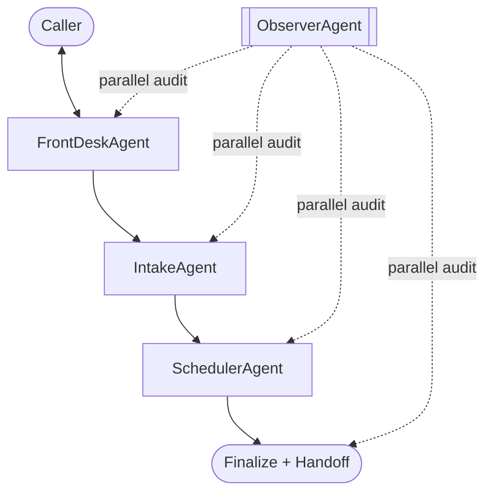

# Happy Hound Multi-Agent Voice Receptionist

LiveKit-based voice receptionist for Happy Hound, using a handoff chain plus a parallel observer.

- Main path: `FrontDesk -> Intake -> Scheduler`
- Parallel path: `ObserverAgent` for hallucination/fact-check monitoring

## What It Does

- Handles front-desk Q&A for daycare, boarding, grooming, and training.
- Starts booking flow and collects intake profile (name, phone, dog weight).
- Preserves package intent (for example, Golden Leash Club Card) across handoffs.
- Checks availability via real Gingr API (grooming) or mock provider (daycare/boarding/training), confirms slot, and builds quote.
- Confirms total and sends structured human handoff email via SMTP.
- Audits assistant claims against business facts plus runtime tool facts.

## Runtime Architecture



Notes:
- `GearAgent` code is preserved but disabled in the active path.
- Observer never becomes the active speaking agent.

## Agent Responsibilities

1. `FrontDeskAgent`
- Greets callers and answers business-info questions.
- Calls `start_booking(service_request=...)` once booking/availability intent is clear.
- Sets canonical selection state early (`service_family`, `service_plan`).

2. `IntakeAgent`
- Runs `TaskGroup` in this order: `NameTask -> PhoneTask -> DogWeightTask`.
- Derives dog size from weight:
  - `<=19: small`, `20-60: medium`, `61-100: large`, `>=101: x-large`
- Transfers to scheduler after profile completion.

3. `SchedulerAgent`
- Auto-resumes on enter (no silent wait after Intake handoff).
- Checks availability, shares slot options, provides slot details, books slot.
- **Grooming**: calls real Gingr API (`tools/gingr_availability.py`) to validate a specific requested time, returns next available slot if the requested time is taken.
- **Mixed-service grooming** (e.g. "Boarding + Deluxe Bath", "Daycare + A la Carte"): detected via `service_name_looks_grooming()`, routes to Gingr path automatically.
- **Inline re-check in `book_slot`**: if the caller accepts the "next available" slot suggested after an unavailable result, `book_slot` re-verifies it with Gingr directly instead of requiring a second `check_availability` round-trip.
- **Daycare / boarding / training**: still uses `MockAvailabilityProvider` (always available).
- Has duplicate in-flight availability guard to prevent repeated tool calls on same request.
- Recomputes totals when needed, asks for explicit approval, and sends structured handoff email via `send_structured_handoff`.

4. `BillingAgent` (disabled in active path)
- Code is preserved for fallback/re-enable.

5. `ObserverAgent` (parallel)
- Captures both `user` and `assistant` turns.
- Evaluates every 6 eligible turns (3 user+assistant pairs).
- Checks claims against:
  - `business_info_happy_hound.txt`
  - per-session `runtime_tool_facts`
- Injects guardrail hint only when contradiction is detected.

## Call Experience Contract

- Transferring agent gives a single transfer message before handoff.
- Receiving agent starts with one short department intro, then continues workflow.
- Long-running tool actions announce wait state first:
  - Scheduler before availability/booking checks.
  - Scheduler before SMTP handoff send.
- Spoken output is intentionally plain, natural, and non-list-heavy for TTS.

## Canonical Session State

Primary shared fields:
- `name`, `phone`
- `dog_weight_lbs`, `dog_size`
- `requested_services`
- `service_family`, `service_plan`, `selection_source`
- `requested_date`, `requested_time`
- `quoted_subtotal`, `quoted_tax`, `quoted_total`, `quote_notes`
- `handoff_status`, `handoff_pending_action`
- `runtime_tool_facts`
- `session_trace_id`

## Service/Plan Normalization

Selection is split into:
- `service_family` (example: `daycare`)
- `service_plan` (example: `golden_leash_club`)

Aliases include common ASR variants so package intent is not collapsed to generic service.

## Voice Configuration

Current default pattern is alternating by handoff chain:
- FrontDesk: female (`andromeda`)
- Intake: male (`SESSION_TTS`, default `arcas`)
- Scheduler: female (`amalthea`)

Per-agent override env keys supported:
- `HH_TTS_FRONTDESK` or `FRONTDESK_TTS`
- `HH_TTS_SCHEDULER` or `SCHEDULER_TTS`

Intake intentionally uses session-level voice to keep TaskGroup utterances consistent and avoid mid-intake voice flips.

## SMTP Handoff Behavior

Scheduler sends structured payload containing:
- customer profile
- dog profile
- service/plan/date/time
- quote breakdown
- workflow metadata

SMTP transport mode:
- `SMTP_PORT=465`: implicit SSL (`SMTP_SSL`) is used automatically.
- Any other port: SMTP with optional STARTTLS controlled by `SMTP_USE_TLS`.

## Environment Variables

Create `.env` with at least:

```env
LIVEKIT_URL=...
LIVEKIT_API_KEY=...
LIVEKIT_API_SECRET=...
OPENAI_API_KEY=...

SMTP_HOST=...
SMTP_PORT=465
SMTP_USER=...
SMTP_PASS=...
HANDOFF_FROM_EMAIL=...
HANDOFF_TO_EMAIL=...

# Gingr API (required for grooming availability checks)
GINGR_API_KEY=...
GINGR_TENANT=happyhound
GINGR_LOCATION_ID=1
# GINGR_API_BASE is auto-derived from GINGR_TENANT if not set

# Optional
# HANDOFF_CC_EMAIL=...
# SMTP_USE_TLS=true

# Session-level voice (also used by Intake)
SESSION_TTS=deepgram/aura-2:arcas

# Optional per-agent overrides
FRONTDESK_TTS=deepgram/aura-2:andromeda
SCHEDULER_TTS=deepgram/aura-2:amalthea

# Optional background ambience
HH_ENABLE_BACKGROUND_AUDIO=1
HH_BACKGROUND_AUDIO_VOLUME=0.15
```

Optional trace flags:

```env
HH_TRACE_HANDOFFS=1
HH_TRACE_STATE=1
HH_TRACE_TOOLS=1
HH_TRACE_OBSERVER=1
```

Console logging level (optional):

```env
# Default is DEBUG if omitted
HH_LOG_LEVEL=DEBUG
```

Notes:
- The app now enforces runtime logger levels for `livekit`, `livekit.agents`, and `doheny-surf-desk`.
- If trace flags are `1`, trace lines will print in the same console stream.

## Install

```bash
uv sync
```

Alternative:

```bash
pip install -e .
```

## Run

```bash
python agent.py dev
```

Then connect using LiveKit Playground or your client app.

## Tests

```bash
pytest -q
```

Current tests cover:
- availability provider behavior
- dog weight task behavior
- SMTP handoff tooling
- observer parsing and evaluation behavior

## Project Layout

```text
doheny-surf-desk/
  agent.py
  business_info_happy_hound.txt
  agents/
    base_agent.py
    frontdesk_agent.py
    intake_agent.py
    scheduler_agent.py
    billing_agent.py         # preserved, not active
    gear_agent.py            # preserved, not active
    observer_agent.py
  tasks/
    name_task.py
    phone_task.py
    dog_weight_task.py
    ...                      # legacy tasks retained
  tools/
    availability_provider.py # mock provider for daycare/boarding/training
    gingr_availability.py    # real Gingr API integration for grooming
    handoff_email_tools.py
    ...                      # legacy tools retained
  prompts/
    *.yaml
  tests/
    test_*.py
```

## Current Design Choices

- Grooming availability uses the real Gingr `POST /api/v1/reservations` API; daycare/boarding/training remain mock (always available).
- `load_dotenv` runs before agent imports in `agent.py` using an absolute path so LiveKit subprocess workers find `.env` regardless of working directory.
- Gear is bypassed at runtime but intentionally kept in source.
- Observer runs in strict global mode with static + runtime fact grounding.
