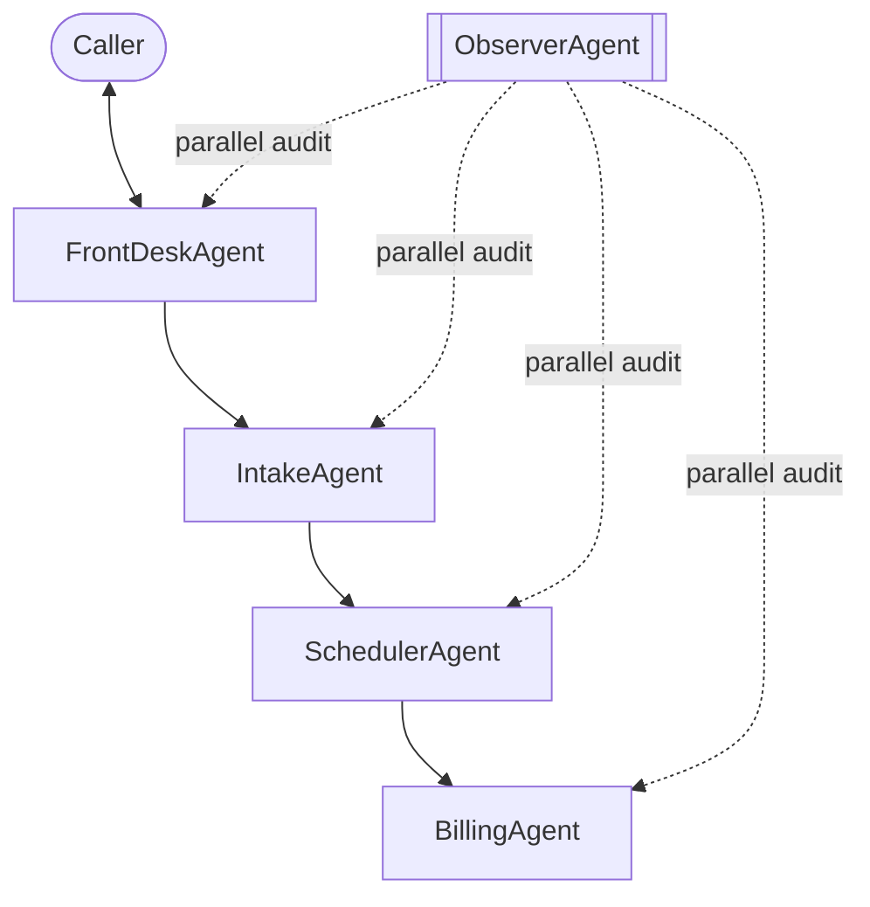

# Happy Hound Multi-Agent Voice Receptionist

This project is a LiveKit-based voice workflow for Happy Hound.

It uses a multi-agent architecture with a parallel observer:
- Main flow: `FrontDesk -> Intake -> Scheduler -> Billing`
- Parallel flow: `ObserverAgent` (hallucination/fact-check monitoring)

## What This Repo Does

- Greets callers and handles service Q&A.
- Starts booking and collects profile data (name, phone, dog weight).
- Checks mock availability and confirms slots for daycare/boarding/grooming/training.
- Preserves package intent (for example, Golden Leash Club Card) across handoffs.
- Confirms final quote and sends a structured handoff email to staff via SMTP.
- Audits assistant responses against business facts and runtime tool facts.

## Active Runtime Architecture



Notes:
- `GearAgent` code is preserved but disabled in the active runtime path.
- Observer runs asynchronously and does not become the active speaker agent.

## Agent Responsibilities

1. `FrontDeskAgent`
- Greets and consults.
- Starts booking via `start_booking(service_request=...)`.
- Normalizes early service intent into canonical session state.

2. `IntakeAgent`
- Runs a sequential `TaskGroup`:
  - `NameTask`
  - `PhoneTask`
  - `DogWeightTask`
- Derives dog size tier from weight.
- Hands off to scheduler.

3. `SchedulerAgent`
- Continues proactively on enter (no silent wait after handoff).
- Collects/uses service, date, and time preference.
- Uses provider boundary (`AvailabilityProvider`) with deterministic `MockAvailabilityProvider`.
- Confirms slot and persists normalized booking state.
- Transfers directly to billing.

4. `BillingAgent`
- Computes/recomputes totals from canonical selection fields.
- Confirms total with caller.
- Sends structured session-state handoff by SMTP with `send_structured_handoff`.

5. `ObserverAgent` (parallel)
- Captures both `user` and `assistant` turns.
- Evaluates every 6 eligible segments (3 user+assistant pairs).
- Audits claims against:
  - static facts: `business_info_happy_hound.txt`
  - runtime authoritative facts from tools (`runtime_tool_facts`)
- Injects guardrail system hints only when contradiction is detected.

## Canonical Session State

Core fields used across handoffs:
- `name`, `phone`
- `dog_weight_lbs`, `dog_size`
- `requested_services`
- `service_family`, `service_plan`, `selection_source`
- `requested_date`, `requested_time`
- `quoted_subtotal`, `quoted_tax`, `quoted_total`, `quote_notes`
- `handoff_status`, `handoff_pending_action`
- `runtime_tool_facts`
- `session_trace_id` (for log correlation)

## Service and Plan Normalization

The scheduler/provider layer separates:
- `service_family` (example: `daycare`)
- `service_plan` (example: `golden_leash_club`)

Aliases map common variants (including ASR misspellings) to canonical values, so package intent is preserved across agents.

## SMTP Handoff Behavior

Billing sends structured payloads with:
- customer profile
- dog profile
- service/plan/date/time
- quote breakdown
- workflow metadata

Transport behavior:
- Port `465`: implicit SSL (`SMTP_SSL`)
- Other ports: SMTP with optional STARTTLS (`SMTP_USE_TLS`)

## Environment Variables

Create `.env` with at least:

```env
LIVEKIT_URL=...
LIVEKIT_API_KEY=...
LIVEKIT_API_SECRET=...
OPENAI_API_KEY=...

SMTP_HOST=...
SMTP_PORT=465
SMTP_USER=...
SMTP_PASS=...
HANDOFF_FROM_EMAIL=...
HANDOFF_TO_EMAIL=...

# Voice model defaults and per-agent voice overrides (optional)
# Format: provider/model:voice_id
SESSION_TTS=deepgram/aura-2:arcas
FRONTDESK_TTS=deepgram/aura-2:andromeda
# INTAKE_TTS is optional; if omitted, Intake uses SESSION_TTS
SCHEDULER_TTS=deepgram/aura-2:amalthea
BILLING_TTS=deepgram/aura-2:zeus

# Optional call-center style ambient background:
HH_ENABLE_BACKGROUND_AUDIO=1
HH_BACKGROUND_AUDIO_VOLUME=0.15
# Optional:
# HANDOFF_CC_EMAIL=...
# SMTP_USE_TLS=true
```

Tracing flags (optional, recommended during debugging):

```env
HH_TRACE_HANDOFFS=1
HH_TRACE_STATE=1
HH_TRACE_TOOLS=1
HH_TRACE_OBSERVER=1
```

## Install

Using `uv`:

```bash
uv sync
```

Using `pip`:

```bash
pip install -e .
```

## Run

```bash
python agent.py dev
```

Then connect from LiveKit Playground or your client app.

## Tests

```bash
pytest -q
```

Current tests cover key areas:
- availability/provider behavior
- dog weight task behavior
- SMTP handoff tooling
- observer parsing/evaluation behavior

## Project Layout

```text
doheny-surf-desk/
  agent.py
  business_info_happy_hound.txt
  agents/
    base_agent.py
    frontdesk_agent.py
    intake_agent.py
    scheduler_agent.py
    billing_agent.py
    gear_agent.py            # preserved, not in active path
    observer_agent.py
  tasks/
    name_task.py
    phone_task.py
    dog_weight_task.py
    ...                      # legacy tasks retained
  tools/
    availability_provider.py
    handoff_email_tools.py
    ...                      # legacy tools retained
  prompts/
    *.yaml
  tests/
    test_*.py
```

## Known Design Choices

- Scheduler is currently backed by a mock provider (real API adapter can plug into `AvailabilityProvider`).
- Gear flow is intentionally bypassed, but code is kept for future re-enable.
- Observer runs in strict global mode with runtime fact grounding.
